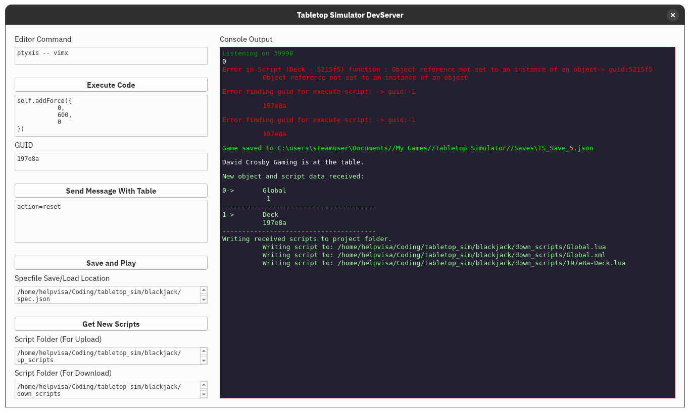

# Tabletop Simulator Dev Server
## A set of tools to aid development in TTS

The Atom plugin for TTS is naturally rather defunct at this juncture, and given
that I'm not prone to coding with VSCode (the only other place a viable plugin
is to be found) I figured it was worth developing a simple set of python
scripts which can interact with the TTS API in order to ease scripting.

The various .py files included in this repository all interface with the TCP
server spun up by TTS when you launch a new game, and some also listen to the
requests made by TTS in order to synchronize scripts (this aspect is still in
the TODO stages). They are completely IDE agnostic and can be used from
within the terminal.

Additionally included (and strongly recommended) is ```__init__.py```, which
constitutes a GUI interface for all of the features exposed by the individual
scripts in this repository. Windows and Linux binaries for this GUI can be
found in the release tags.



## How to use
If you intend to use the GUI, then it's as simple as running the binary and
starting a game in Tabletop Simulator! If you'd like to know more about what the
buttons do, read below into the scripts category.

One note of advice: if you've added any new objects into the scene since your
last save, make sure you *create a new save or overwrite your current save in
Tabletop Simulator first before pressing ```Save and Play```*. New objects
with scripts are not automatically persisted when the save is reloaded!

## Scripts
You can run any one of the scripts with the -h flag to get a quick rundown of
how they might be used.

### dev_server.py
```dev_server.py``` spins up a listen server which waits for messages from TTS
on port 39998. A folder must be specified to which the listen server can dump
scripts it receives from TTS upon loading a save; if you want TTS to actually
open newly-created scripts for objects in the text editor of your choice, you
must specify a command that the server can run with the ```-e``` flag, for
example:
```
./dev_server.py /path/to/scripts/folder -e "xterm -e vim"
```
...or if you are running an editor that supports operating as a server:
```
./dev_server.py /path/to/scripts/folder -e "gvim --remote"
```
The TTS API frequently sends messages to the listen server which dump a lot of
script data and more-or-less ask the editor to save them somewhere for editing.
Generally this isn't an issue but in some circumstances (for example, if you ask
TTS to retrieve script data but have not yet pushed your edited scripts back to
the game using ```save_and_play.py```) this behaviour can cause data loss. If
you want to minimize the possibility of this happening, I would recommend
creating a "dump" folder where TTS can dump scripts (specifying this as the
folder that ```dev_server.py``` should use) and a "work" folder which stores
scripts you are actively editing and plan to send back to TTS.

### save_and_play.py
```save_and_play.py``` uses a spec.json file (it can be named anything you want)
to send a set of scripts and xml files to the currently loaded game, triggering
a reload. This is the meat-and-potatoes script, and you'll be running it a lot
when you're done making changes in your editor of choice. In order for it to
work correctly, you must create a JSON file that follows a format like:
```
[
    {
        "name": "Global",
        "guid": "-1",
        "script": "/global/path/to/script.lua",
        "ui": "/global/path/to/definition.xml"
    },
    {
        "name": "Block Square",
        "guid": "67362e",
        "script": "/global/path/to/another/script.lua"
    }
]
```
If you're using the GUI, then this JSON file will be automatically generated for
you every time you press "Save and Play". Once this file is setup,
```save_and_play.py``` can be pointed at it and it will act upon your
definitions. The ```script``` and ```ui``` keys can optionally be omitted,
however at least one of the two is required for each object.

### send_message.py
```send_message.py``` interacts with the onExternalMessage() event in TTS. It
allows you to send a table of key=value pairs which can be used by scripted
objects in-game.

### execute_lua_code.py
```execute_lua_code.py``` allows you to execute lua code on any object in the
loaded game. Use a GUID of ```-1``` instead of an object GUID in order to
execute code in a Global scope. This is useful for templating functions and
trying them out on various in-game objects. For example, you could write some
code into a test_code.lua file and run the command like so (assuming a
POSIX-compliant terminal is at hand):

```
./execute_lua_code.py "67362e" "$(cat ./test_code.lua)"
```
